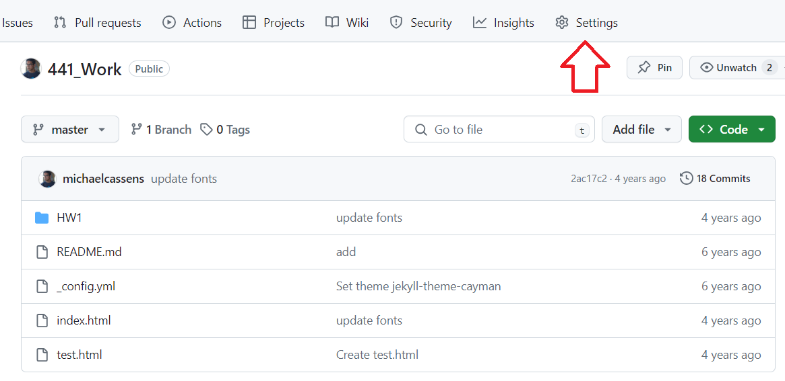
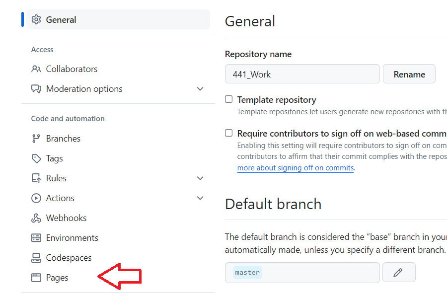
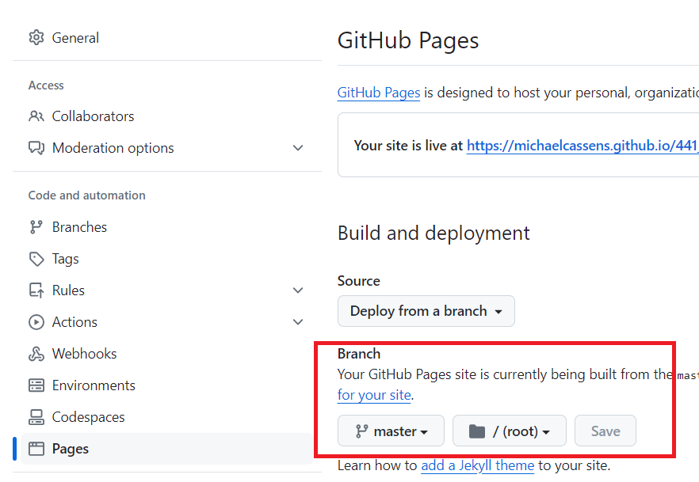
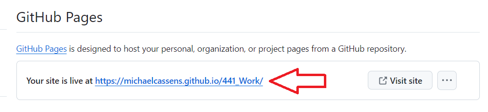

# Set Up GitHub

You all should have GitHub, so now we are going to make GitHub Pages is active so you can share any/all projects with everyone.

How do you do that?

Step 1 - Go to the Settings of your Repository

Step 2 - Scroll down and click on Pages

Step 3 - Choose the master branch and click Save

Step 4 - View your page

