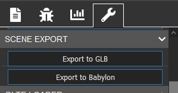

## Set up

Now it is time to start our learning journey together. These first steps will introduce you to the basics of using Babylon.js to create a scene, code a simple model and export it. Not only can models be created with Babylon.js, a range of model types created in other software can also be imported into Babylon.js. We will show you how to import a model into a scene, display it on the web and create a web app from it. From this beginning which replaces the usual 'Hello World' introduction, we will build a simple world, step by step. At the end of the journey, we will have created a small village demonstrating the features of Babylon.js.

Want to try out Babylon.js straight away? The examples on each page are also presented using our interactive Playground where you can write, view and experiment with code immediately. Code properly formed and working within the Playground can be copied and pasted into an HTML template and used as your first web app.

### First Scene and Model

Whether you are creating a whole world or just placing one model into a web page you need a scene to contain the world or model, a camera to view it, a light to illuminate it and, of course, at least one viewable object as a model. All models, whether just a box or a complex character, are made from a mesh of triangles or facets.

### Say Hello to Your First World

All projects using the Babylon.js Engine need a scene with a camera and a light added. Then we can create our box.

Wait...what is the Babylon.js Engine you ask? Excellent question. The engine variable seen below is the class that's responsible for interfacing with lower-level APIs such as WebGL, Audio, etc. The constructor to create a Babylon scene (the context that renders visuals to the screen) needs the engine to talk to these lower level APIs. This is why the engine variable is needed when creating a scene.

```js
const scene = new BABYLON.Scene(engine);

const camera = new BABYLON.ArcRotateCamera("camera", -Math.PI / 2, Math.PI / 2.5, 3, new BABYLON.Vector3(0, 0, 0), scene);
camera.attachControl(canvas, true);

const light = new BABYLON.HemisphericLight("light", new BABYLON.Vector3(0, 1, 0), scene);

const box = BABYLON.MeshBuilder.CreateBox("box", {}, scene);
```

Like most meshes created with MeshBuilder the box is created positioned with its center at the origin and needs three parameters. These are a name, a string, options, a JavaScript object, and a scene. By leaving the options as an empty object with no properties the box defaults to one of unit size for its width, height and depth.

To be usable in a playground we need to place these within a function called createScene which has to return a scene. The playground app takes care of the rest.

```js
const createScene = () => {
    const scene = new BABYLON.Scene(engine);

    const camera = new BABYLON.ArcRotateCamera("camera", -Math.PI / 2, Math.PI / 2.5, 3, new BABYLON.Vector3(0, 0, 0));
    camera.attachControl(canvas, true);

    const light = new BABYLON.HemisphericLight("light", new BABYLON.Vector3(0, 1, 0));

    const box = BABYLON.MeshBuilder.CreateBox("box", {});

    return scene;
}
```
Since at this point there is only one scene you may notice that this parameter can be dropped from the camera, light and box as the default is for them to be placed in the current scene.


Having created our box we can save, or export, the scene from within the playground by selecting the Inspector


followed by Tools and choose which type to export, the .babylon format or the GLB format.



Now we have a file we can use it to demonstrate how to view it in a web page.
